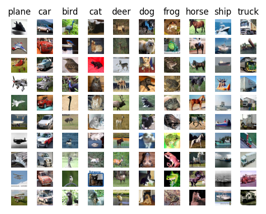
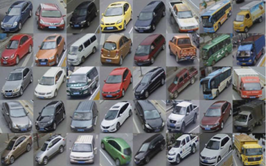
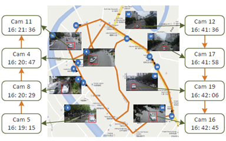
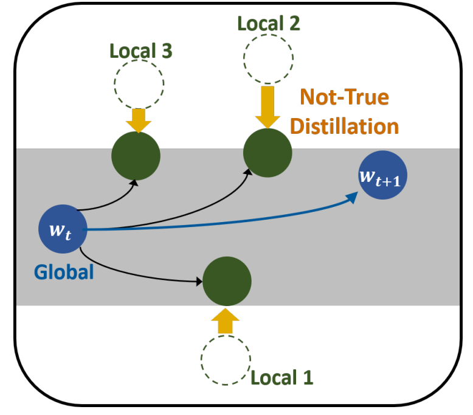
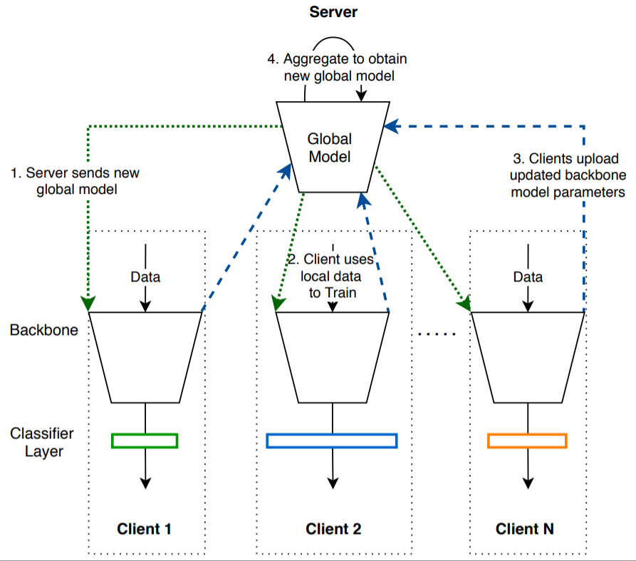

# nn-dist-train-poc

### Acknowledgement
This work was supported by Institute of Information & communications Technology Planning & Evaluation (IITP) grant funded by the Korea government(MSIT) (No. 2021-0-00907, Development of Adaptive and Lightweight Edge-Collaborative Analysis Technology for Enabling Proactively Immediate Response and Rapid Learning).


# Directory explanation

1. Federated image classification: embedded_devices (fedavg), fedntd_embedded_devices (fedntd)
2. Federated vehicle Re-ID: fedpav_reid (fedpav), fedntd_reid(fedpav+fedntd)


# Federated Learning on Embedded Devices with Flower

This demo will show you how Flower makes it very easy to run Federated Learning workloads on edge devices. Here we'll be showing how to use NVIDIA Jetson devices and Raspberry Pi as Flower clients. This demo uses Flower with PyTorch. The source code used is mostly borrowed from the [example that Flower provides for CIFAR-10](https://github.com/adap/flower/tree/main/src/py/flwr_example/pytorch_cifar).

## Getting things ready

This is a list of components that you'll need: 

* For server: A machine running Linux/macOS.
* For clients: either a Rapsberry Pi 3 B+ (RPi 4 would work too) or a Jetson Xavier-NX (or any other recent NVIDIA-Jetson device).
* A 32GB uSD card and ideally UHS-1 or better. (not needed if you plan to use a Jetson TX2 instead)
* Software to flash the images to a uSD card (e.g. [Etcher](https://www.balena.io/etcher/))

What follows is a step-by-step guide on how to setup your client/s and the server. In order to minimize the amount of setup and potential issues that might arise due to the hardware/software heterogenity between clients we'll be running the clients inside a Docker. We provide two docker images: one built for Jetson devices and make use of their GPU; and the other for CPU-only training suitable for Raspberry Pi (but would also work on Jetson devices). 

## Clone this repo

Start with cloning the Flower repo and checking out the example. We have prepared a single line which you can copy into your shell:

```bash
$ git clone https://github.com/etri-edgeai/nn-dist-train-poc.git
```

## Setting up the server

The only requirement for the server is to have flower installed. You can do so by running `pip install flwr` inside your virtualenv or conda environment.

## Setting up a Jetson Xavier-NX

> These steps have been validated for a Jetson Xavier-NX Dev Kit. An identical setup is needed for a Jetson Nano and Jetson TX2 once you get ssh access to them (i.e. jumping straight to point `4` below). For instructions on how to setup these devices please refer to the "getting started guides" for [Jetson Nano](https://developer.nvidia.com/embedded/learn/get-started-jetson-nano-devkit#intro) and [Jetson TX2](https://developer.nvidia.com/embedded/dlc/l4t-28-2-jetson-developer-kit-user-guide-ga). 

1. Download the Ubuntu 18.04 image from [NVIDIA-embedded](https://developer.nvidia.com/embedded/downloads), note that you'll need a NVIDIA developer account. This image comes with Docker pre-installed as well as PyTorch+Torchvision compiled with GPU support.
2. Extract the imgae (~14GB) and flash it onto the uSD card using Etcher (or equivalent).
3. Follow [the instructions](https://developer.nvidia.com/embedded/learn/get-started-jetson-xavier-nx-devkit) to setup the device.
4. Installing Docker: Docker comes pre-installed with the Ubuntu image provided by NVIDIA. But for convinience we will create a new user group and add our user to it (with the idea of not having to use `sudo` for every command involving docker (e.g. `docker run`, `docker ps`, etc)). More details about what this entails can be found in the [Docker documentation](https://docs.docker.com/engine/install/linux-postinstall/). You can achieve this by doing:
    ``` bash
    $ sudo usermod -aG docker $USER
    # apply changes to current shell (or logout/reboot)
    $ newgrp docker
    ```
5. The minimal installation to run this example only requires an additional package, `git`, in order to clone this repo. Install `git` by:

    ```bash
    $ sudo apt-get update && sudo apt-get install git -y
    ```


## Setting up a Raspberry Pi (3B+ or 4B)

1. Install Ubuntu server 20.04 LTS 64-bit for Rapsberry Pi. You can do this by using one of the images provided [by Ubuntu](https://ubuntu.com/download/raspberry-pi) and then use Etcher. Alternativelly, astep-by-step installation guide, showing how to download and flash the image onto a uSD card and, go throught the first boot process, can be found [here](https://ubuntu.com/tutorials/how-to-install-ubuntu-on-your-raspberry-pi#1-overview). Please note that the first time you boot your RPi it will automatically update the system (which will lock `sudo` and prevent running the commands below for a few minutes)

2. Install docker (+ post-installation steps as in [Docker Docs](https://docs.docker.com/engine/install/linux-postinstall/)):
    ```bash
    # make sure your OS is up-to-date
    $ sudo apt-get update

    # get the installation script
    $ curl -fsSL https://get.docker.com -o get-docker.sh

    # install docker
    $ sudo sh get-docker.sh

    # add your user to the docker group
    $ sudo usermod -aG docker $USER

    # apply changes to current shell (or logout/reboot)
    $ newgrp docker
    ```


# Dataset

For this demo we'll be using cifar 10 and veri 776. cifar 10 (https://www.cs.toronto.edu/~kriz/cifar.html), a popular dataset for image classification comprised of 10 classes (e.g. car, bird, airplane) and a total of 60K `32x32` RGB images. The training set contains 50K images. 




veri776 (https://github.com/JDAI-CV/VeRidataset), is  a large-scale benchmark dateset for vehicle Re-Id in the real-world urban surveillance scenario. It contains over 50,000 images of 776 vehicles captured by 20 cameras covering an 1.0 km^2 area in 24 hours, which makes the dataset scalable enough for vehicle Re-Id and other related research. The images are captured in a real-world unconstrained surveillance scene and labeled with varied attributes, e.g. BBoxes, types, colors, and brands. So complicated models can be learnt and evaluated for vehicle Re-Id. Each vehicle is captured by 2 ∼ 18 cameras in different viewpoints, illuminations, resolutions, and occlusions, which provides high recurrence rate for vehicle Re-Id in practical surveillance environment. It is also labeled with sufficient license plates and spatiotemporal information, such as the BBoxes of plates, plate strings, the timestamps of vehicles, and the distances between neighbouring cameras. 

&ensp;&ensp;&ensp;&ensp;&ensp;&ensp;

The server will automatically download the dataset should it not be found in `./data`. To keep the client side simple, the datasets will be downloaded when building the docker image. This will happen as the first stage in both `run_pi.sh` and `run_jetson.sh`.


## Server

Launch the server and define the model you'd like to train. The current code (see `utils.py`) provides two models for CIFAR-10: a small CNN (more suitable for Raspberry Pi) and, a ResNet18, which will run well on the gpu. Each model can be specified using the `--model` flag with options `Net` or `ResNet18`. Launch a FL training setup with one client and doing three rounds as:
```bash
# launch your server. It will be waiting until one client connects
$ python3 server.py --server_address <YOUR_SERVER_IP:PORT> --rounds 30 --min_num_clients 4 --min_sample_size 4 --model ResNet18
```

## Clients

Asuming you have cloned this repo onto the device/s, then execute the appropiate script to run the docker image, connect with the server and proceed with the training. Note that you can use both a Jetson and a RPi simultaneously, just make sure you modify the script above when launching the server so it waits until 2 clients are online. 

### For Jetson

```bash
$ ./run_jetson.sh --server_address=SERVER_ADDRESS:8080 --cid=0 --model=ResNet18 --batch_size 50
$ python3 client.py --server_address=SERVER_ADDRESS:8080 --cid=0 --model=ResNet18 --batch_size 50
```

### For Raspberry Pi

Depending on the model of RapsberryPi you have, running the smaller `Net` model might be the only option due to the higher RAM budget needed for ResNet18. It should be fine for a RaspberryPi 4 with 4GB of RAM to run a RestNet18 (with an appropiate batch size) but bear in mind that each batch might take several second to complete. The following would run the smaller `Net` model:

```bash
# note that pulling the base image, extracting the content might take a while (specially on a RPi 3) the first time you run this.
$ ./run_pi.sh --server_address=<SERVER_ADDRESS> --cid=0 --model=Net
```

### Baseline(fedavg) and proposed Algorithm(fedntd) for federated image classification 


[**"Preservation of Global Knowledge by Not-True Distillation in Federated Learning (NeurIPS 2022)"**](https://arxiv.org/abs/2106.03097).



### Baseline Algorithm for federated vehicle re-id (fedpav)

Code for ACMMM 2020 oral paper - **[Performance Optimization for Federated Person Re-identification via Benchmark Analysis](https://arxiv.org/abs/2008.11560)**

Personal re-identification is an important computer vision task, but its development is constrained by the increasing privacy concerns. Federated learning is a privacy-preserving machine learning technique that learns a shared model across decentralized clients. In this work, we implement federated learning to person re-identification (**FedReID**) and optimize its performance affected by **statistical heterogeneity** in the real-world scenario. 

Algorithm: Federated Partial Averaging (FedPav)



# Result of federated image classification (dataset:cifar 10) 

communication round:3, local iteration:1

||1st|2nd|3rd|
|------|---|---|---|
|fedavg|54.31|58.84|51.55|
|fedntd|66.72|65.13|64.55|
|accuracy improvement|12.41|6.29|13.00|

# Result of federated vehicle re-id (dataset: veri 776) 

communication round:30, local iteration:1

CMC (Cumulative Matching Characteristics)
AP (Average Precision)

||CMC rank@1|CMC Rank@5|CMC Rank@10|AP|
|------|---|---|---|---|
|fedpav|40.00|72.50|85.00|0.19|
|fedntd|45.00|75.00|90.00|0.20|
